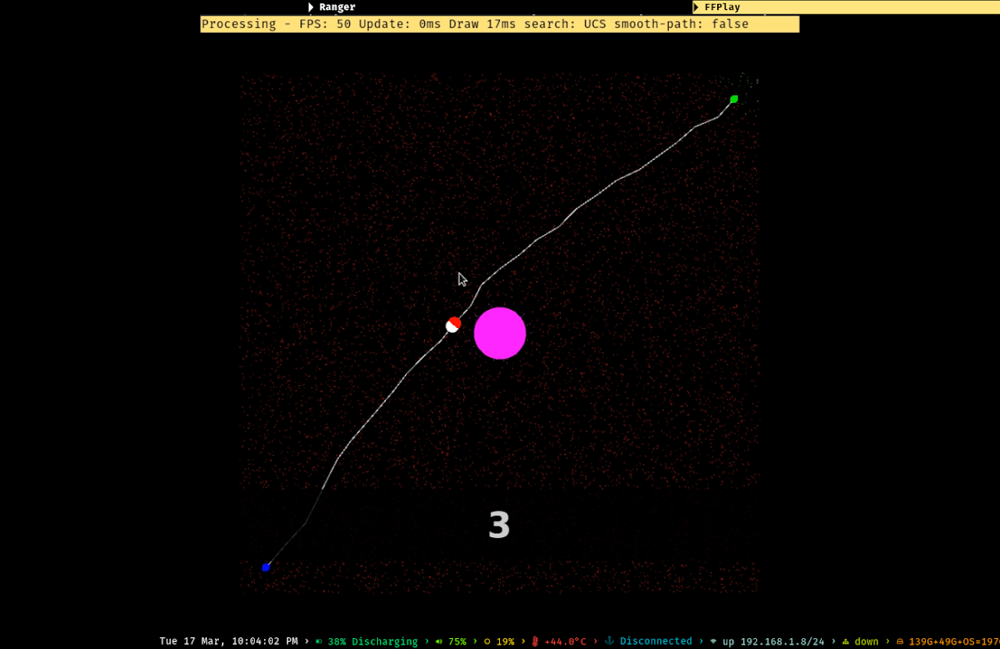

# motion planning

## description
- Simple motion planning algorithms for single agent, crowd and flocks in known/unknown environments.
- The task for an agent is to reach its goal without colliding with obstacles or other agents.
## code
- Code is written in Java, should work with JRE 8+.
    - `src/` contains all source code.
    - `jars/` contain all libraries bundled as jars.
        - `processing` is used as a rendering library.
        - `queasy cam` is used as a camera library.
    - `data/` contains resources such as images, obj, mtl files.
## documentation
- For most of the code, the documentation is itself.
## usage
- Open a terminal at project root (the directory containing this file).
- Use `javac -cp "jars/*" -d build/ $(find -name "*.java")` to compile and put all output class files under `build/`.
- Use `java -cp "build/:jars/*" <package>.<to>.<path>.<class>` to run any simulation.
    - For example `java -cp "build/:jars/*" demos.WalkCycle`.
- Common controls
    - `w a s d` for basic camera movements.
    - `q e` for camera up and down movements.
    - `p` for pause/play.
- Tested on Ubuntu 18.04
    - If you use a distrubution that uses rolling release cycle (like Arch) you might have to install some older version of JRE and mesa (opensource intel openGL driver) that work with processing library.
## demonstration
The following color scheme is used in all videos.
| Syntax      | Description |
| ----------- | ----------- |
| white sphere/line | agent |
| red sphere/line | agent in the future (useful to visualize how the path is smoothed) |
| green cube | goal |
| pink circle | obstacle |
| white point | sampled milestone |
| pink point  | milestone inside obstacle |
| green point | milestone on the fringe during search |
| red point | explored milestone during search |
The title bar shows the state of the system at any instant (current search algorithm, path smoothing on/off ...).
### Search methods on PRM and path smoothing
#### videos

A circular agent is in a square room.
Its goal is to reach the other diagonal.
But there is an obstacle in the middle of the room.
Most of the demos use path smoothing.

#### images
- DFS

- BFS

- UCS

- A\*

- weighted A\*

---

### Crowds using `time-to-collision` method
#### videos
- Simple case

- Antipodes

- Traffic circle

- Bottleneck

- Crosspaths

- Hallway

- 2D swarms

### Crowds using `boids` method
#### videos
- Two flocks

### `boids` vs `time-to-collision`
#### videos
| time-to-collision | boids |
| ----------- | ----------- |
|  |  |
|  |  |
